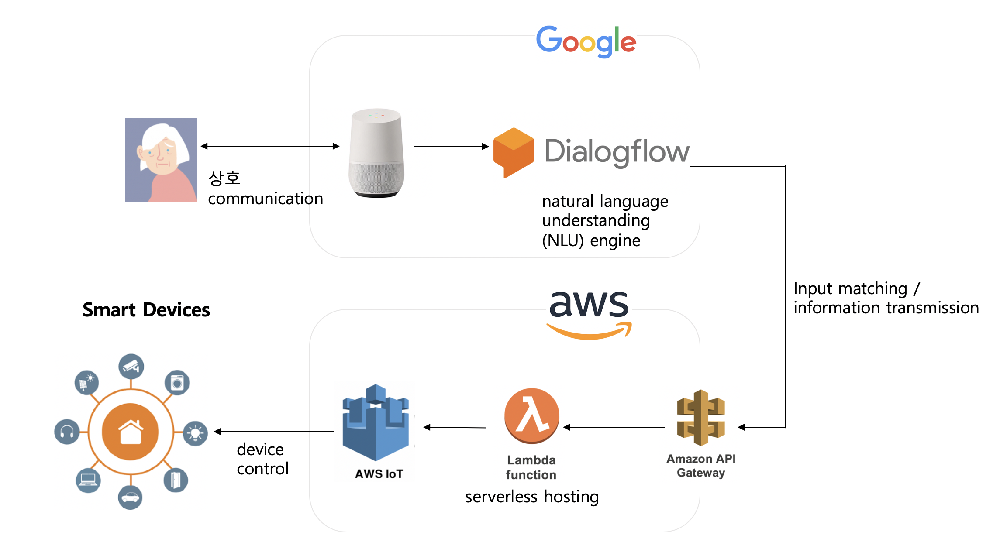

# Google Home(Dialogflow)와 AWS를  연동하여 독거노인의 주거 환경 개선 

## Cross-Platform을 통하여 현실적으로 독거노인들에게 도움을 주는 방법 
1. 최신 IT기술에 익숙하지 못한 독거노인들에게 음성으로 기술들을 쉽게 접근하게 도와준다.
   - 최신 IT기술에 익숙하지 못한 독거노인들에게 음성을 통한 Smart Devices 통제
   - 음성(Google Home)으로 위험 알림 서비스 제공
   
2. 혼자 사는 독거노인들의 겪는 외로움의 부분적 해소에 도움
   - Chat Bot 
   - 감정 파악을 통하여 감정에 맞는 대화 서비스 제공
   
---

## 해당 프로젝트를 진행하기 위하여 필요한 준비물

1. AWS 계정
2. 구글 계정
3. node.js 코딩을 위한 Visual Code 

---

## 전체적인 시스템 구조

- DialogFlow를 통한 Application와 AWS를 이용한 Backend Service를 만들어 서비스를 제공합니다

---

### 준비가 끝났으니 단계에 따라 천천히 따라와 주세요! 👋

- [RDS 생성하기](https://github.com/jaehui327/AUSG-iOS-MapOfRestaurant/blob/master/guide/RDS_guide.md)

- [Node.js 코드 만들기](https://github.com/jaehui327/AUSG-iOS-MapOfRestaurant/blob/master/guide/Nodejs_guide.md)

- [Elastic Beanstalk으로 배포하기](https://github.com/jaehui327/AUSG-iOS-MapOfRestaurant/blob/master/guide/Beanstalk_guide.md)

- [iOS 앱과 API 서버 연동하기](https://github.com/jaehui327/AUSG-iOS-MapOfRestaurant/blob/master/guide/iOS_guide.md)

- [삭제 가이드](https://github.com/jaehui327/AUSG-iOS-MapOfRestaurant/blob/master/guide/delete_guide.md)
